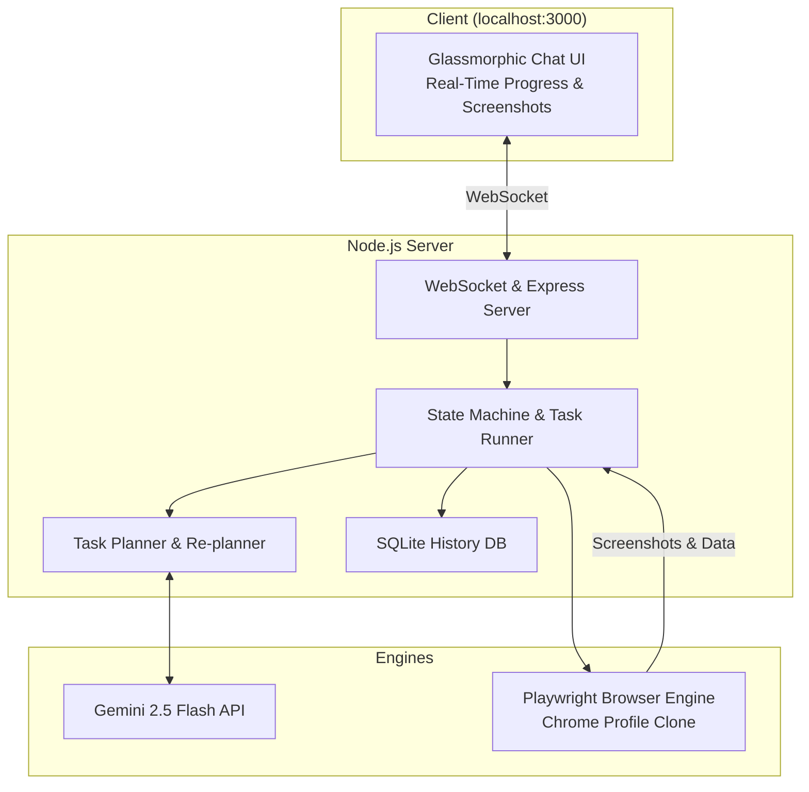

# 🧭 Pilot — Personal AI Browser Control Agent

Pilot is an autonomous, vision-enabled AI browser control agent. It takes natural language instructions, breaks them down into structured execution plans, controls a real Chrome browser with your saved logins & cookies, and reports back in real-time with step-by-step logs and screenshots.


---

## ✨ Features

- 🧠 **Autonomous Planning**: Powered by Google Gemini (Gemini 2.5 Flash), breaking down high-level user commands into atomic browser actions (navigation, typing, clicking, extracting, scrolling).
- 👁️ **Visual Multimodal Feedback**: Captures screenshots at every step and streams them live to the chat interface with an expandable lightbox.
- 🛡️ **Human-in-the-Loop Confirmation**: Pauses automatically and requests your explicit approval before executing sensitive or irreversible actions (form submissions, emails, purchases, deletes).
- 🍪 **Persistent Session & Saved Logins**: Clones your local Chrome profile so the agent operates with your active cookies and sessions without session-lock conflicts.
- 🔄 **Dynamic Self-Healing & Re-Planning**: Automatically inspects error states with AI vision and generates alternative step plans when pages change or elements fail.
- 📜 **Full History Storage**: Stores past tasks, plans, execution logs, and summaries in a local SQLite database (`better-sqlite3`).
- 💎 **Premium Dark Mode UI**: Responsive glassmorphic interface with WebSocket streaming, real-time status indicators, and collapsible task timelines.

---

## 🛠️ Architecture



---

## 🚀 Quick Start

### 1. Prerequisites
- **Node.js**: v18 or higher
- **Google Chrome**: Installed on your system
- **Gemini API Key**: Free tier from [Google AI Studio](https://aistudio.google.com)

### 2. Installation
```bash
git clone <your-repo-url>
cd pilot
npm install
npx playwright install chromium
```

### 3. Run Pilot
```bash
npm start
```
Open [`http://localhost:3000`](http://localhost:3000) in your browser.

### 4. Configure API Key
1. Click the **⚙️ Settings** icon in the top right corner of the Pilot UI.
2. Paste your Gemini API key and hit **Save**.
3. Toggle between **Visible** (watch the browser click and type live) or **Headless** mode.

---

## 📁 Project Structure

```
pilot/
├── public/                    # Frontend Chat UI
│   ├── css/styles.css         # Glassmorphic dark theme
│   ├── js/app.js              # WebSocket & UI rendering logic
│   └── index.html             # Single-page interface
├── src/
│   ├── ai/
│   │   ├── gemini.js          # Gemini client wrapper
│   │   ├── planner.js         # Multi-step task planner
│   │   └── prompts.js         # Vision & planning system prompts
│   ├── browser/
│   │   ├── controller.js      # Playwright browser controller
│   │   └── profile.js         # Chrome profile auto-detection & cloner
│   ├── executor/
│   │   ├── actionHandlers.js  # Action mapping (click, type, scroll, extract)
│   │   └── taskRunner.js      # Execution state machine & approval flow
│   ├── server/
│   │   └── index.js           # Express REST API & WebSocket server
│   ├── storage/
│   │   └── history.js         # SQLite database management
│   └── index.js               # Main entry point
├── data/                      # Local SQLite DB & screenshots (git-ignored)
└── package.json
```

---

## 🔒 Security & Privacy

- **Local Execution**: All browser sessions, SQLite history, and profile data stay entirely on your local machine.
- **Git Safety**: `.gitignore` is pre-configured to ensure your `.env` file, cookies, and local database are never committed or pushed.
